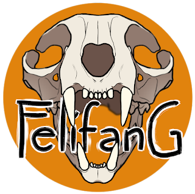

<h1 align="center">FELIFANG</h1>

  <em>Не жди судьбы. Создай её. Когтями. Голосом. Кланом.</em>

  

> **Статус:** активная разработка

## Для кого этот проект

### Если Вы студент
Вы хотите получить реальный опыт, который можно показать работодателю. Здесь вы научитесь:
- работать с микросервисами (Go, PostgreSQL, Redis, Docker);
- проектировать архитектуру и фиксировать решения в ADR;
- писать код, который проходит ревью и вливается в основную ветку;
- работать в команде с использованием Git Flow.

Это два в одном: учебный проект, перерастающий в настоящую разработку с дедлайнами, спринтами и документацией. Ваш вклад будет виден в портфолио.

### Если Вы работодатель
Вы видите перед собой студентов, которые:
- самостоятельно проектируют микросервисную архитектуру;
- внедряют JWT с асимметричным шифрованием (RS256) и JWKS;
- используют ADR для документирования решений;
- стараются писать чистый код с разделением на слои (handlers → service → storage);
- любят своё дело.

Это «пет-проект для души», но с системным подходом к разработке, который может быть применён в компании.

## Что это?

Felifang — это богатый мир, где истории пишут не только разработчики, но и сами игроки. Здесь социальная жизнь и игровой процесс переплетаются: ваши посты и петиции, решения кланов и голос сообщества напрямую влияют на развитие игры.

Не просто RPG — экосистема с динамичными боями, живыми анимациями, генеалогией, группировками и политикой. Здесь в облике кота можно сражаться, растить семью, влиять на судьбы и находить друзей. Но главное: мы строим мир, где механики не существуют отдельно от Вас, а дополняют друг друга, чтобы каждый игрок чувствовал себя частью чего-то большого.

## О нас

Мы, «Стрежá» — команда энтузиастов, которые хотят создать интересный и приятный мир, не похожий на существующие. Не просто игру, а пространство, в котором хочется оставаться, общаться, развиваться, творить и строить гипотезы. Мы поставили перед собой амбициозный вызов разработки, чтобы побороть страх перед новизной и ответственностью. Чтобы нам самим было, чем гордиться.

### Кто мы?

| Участник | Роль | Контакты |
|----------|------|----------|
| [**Белоснежный/Снеж**](./TEAM.md#белоснежный--снеж) | Владелец проекта, backend-разработчик, Team Lead | [GitHub](https://github.com/Snow-white-Cloud) · [ВК](https://vk.ru/snow_white_cloud) |
| [**Цвета/Жара**](./TEAM.md#цвета--жара) | Дизайнер, генератор идей | [ВК](https://vk.ru/rezdby) · [Telegram](https://t.me/rezdby)|
|  [**Вайвер/Шёпот**](./TEAM.md#вайвер--шёпот) | Саунд-дизайнер, лоровед, документация | [ВК](https://vk.ru/waiwer) · [Telegram](https://t.me/stormandrage) |
| *Здесь можете быть Вы!* | *Ваша роль* | *Ваши контакты* |

[Подробнее о каждом](./TEAM.md).

## Технологический стек
Подробнее о выборе технологий — в [ADR](./docs/adr/001-tech-stack.md). 

### Бэкенд
- **Go**: основной язык разработки.
- **PostgreSQL**: реляционная база данных, источник истины.
- **Redis**: кэширование, управление сессиями, rate limiting.
- **Docker / Docker Compose**: контейнеризация и локальное окружение.
- **JWT (RS256)**: асимметричное подписывание токенов.
- **JWKS**: публичные ключи для валидации токенов.
- **chi**: HTTP-роутер.

### Безопасность
- хеширование паролей;
- CSRF-защита (в плане);
- 2FA (в плане);
- ротация Refresh-токенов (в процессе).

### Документация и процесс
- GitHub + Git Flow.
- ADR (Architecture Decision Records).
- Спринты с ретроспективой.
- Swagger (в плане).

## Что здесь можно увидеть?
- [Устав](./CONSTITUTION.md) — цели, правила, контакты.
- [Дорожная карта](./ROADMAP.md) — планы развития.
- [Спринты](./docs/sprint-history.md) — процесс разработки.
- [ADR](./docs/adr) — архитектурные решения.
- [Роли](./ROLES.md) — необходимые проекту люди, требования к ним и выгода для них.
- [Команда](./TEAM.md) — состав команды, подробности об участниках. 
- [Сборный файл](./CODE_SAMPLES.md) — описание всех примеров кода.
- [Лицензия](./LICENSE).

## Дорожная карта
**Сейчас:** разрабатываем Auth-сервис (JWT, JWKS, верификация).     
**Скоро:** Social-сервис и мессенджер.   
**В будущем:** игровая логика, генеалогия, бои.

Подробнее: [ROADMAP.md](ROADMAP.md)

## Мы ищем единомышленников!

Будем рады принять в команду, чтобы вместе развивать проект. Даже если кажется, что навыков и знаний мало, не стесняйтесь отзываться: примем, адаптируем, терпеливо научим. Нам важны любые помощники или энтузиасты в постоянный состав. Возможно, именно Ваши идеи и Ваша искра помогут проекту задышать свободнее.

Можете ознакомиться с [полным списком](./ROLES.md) необходимых людей, а также требованиями и выгодой, которую получите от сотрудничества.

**Как присоединиться:**
в [правилах вступления](./CONSTITUTION.md#4-как-присоединиться) описаны подробнее шаги по вступлению.

## Для работодателей

Этот репозиторий — наша открытая витрина. Здесь мы делаем упор не на код, а то, как мыслим и строим систему: архитектуру, документацию, процесс и подход к разработке.

**Архитектура** включает схемы микросервисов, описание взаимодействия между ними, выбор технологий и обоснование решений.

**Процесс** ведётся с помощью ADR и спринтов на основе Agile-разработки. Фиксируем каждое решение и каждый шаг, составляем планы и выполняем собственные дедлайны. При расширении штата команды также планируем внедрить Jira.

**Качество подхода** определяется его структурой: слои, комментарии и логика сборки отражены в документации, закомментированы и интуитивно понятны. Мы стараемся придерживаться принципов SOLID, переписывая функционал из раза в раз там, где с непривычки их нарушили.

### Доступ к коду

Полный код находится в закрытом репозитории. Если Вы хотите увидеть реализацию, мы готовы предоставить доступ к закрытому репозиторию по запросу.

**Чтобы получить доступ:**

1. Напишите в [ВК](https://vk.ru/snow_white_cloud) или Telegram, указанный в анкете на стажировку.
2. Или отправьте запрос на почту: Fedorova.study@yandex.ru.

**В запросе укажите:**
- Ваше имя и компанию (если есть)
- Цель запроса (оценка кода, стажировка)

Доступ будет предоставлен в течение 24 часов.

*Все данные о запросе конфиденциальны и не передаются третьим лицам.*